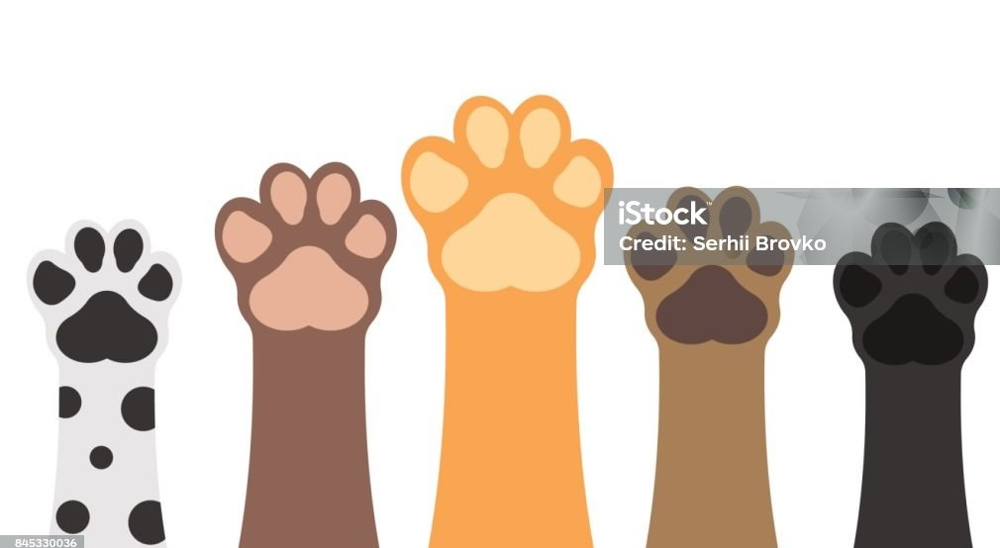
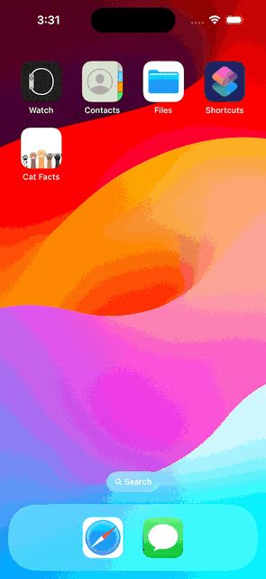

# Cat Facts

A simple app to browse Cat images and Cat facts.

## Description

This project is written in and Swift and uses SwiftUI.

## Getting Started

### Dependencies

* Kingfisher - for async loading of images and caching.
* Mocker - a network mocking library 

### Installing

* Open the project in Xcode then run the project
* If you want to use a local mock server, manually change the environment variable with a value other than "dev" and make sure to head over to the **Endpoint** struct to use a custom IP address if needed.

### Local Mock Server

You can use [Mockoon](https://mockoon.com) to run a local REST API server. You can import the environment file found in the **Mockoon** directory.

## How the app works

When the app launches it will preload a number of objects in the background. As soon as the app had launched completely tap the start button and the first Cat info will be displayed. To view another Cat, tap the screen. The app will keep preloading cat objects so you will have an endless Cat facts.

